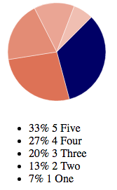
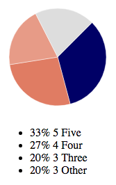

[](https://travis-ci.org/saztul/ember-basic-charts)
[](https://codeclimate.com/github/saztul/ember-basic-charts)
[](https://badge.fury.io/js/ember-basic-charts)

# ember-basic-charts

A collection of charts written for and in Ember.
No dependecies apart from the default Ember packages.

## Included charts

* [Pie chart](#pie-chart)
* [Bar chart](#bar-chart)
* [Value range chart](#value-range-chart)

### <a name=pie-chart></a>Pie Chart
#### Data
```javascript
slices = [
  { "label":"One",    "value":1 },
  { "label":"Two",    "value":2 },
  { "label":"Three",  "value":3 },
  { "label":"Four",   "value":4 },
  { "label":"Five",   "value":5, "color": '#006' }
]
```

#### Minimal
```hbs
{{pie-chart
  slices=slices
}}
```


#### All options
```hbs
{{pie-chart
  slices=slices
  slicesMax=4
  radius=70
  tilt=315
  borderColor="rgba(255,255,255,0.5)"
  bumpBy=5
  otherLabel="Other"
  otherColor="#dddddd"
  emptyColor="#eeeeee"
  noDataMessage="No data"
  seedColor="#d13f19"
}}
```



## Installation

* `git clone <repository-url>` this repository
* `cd ember-basic-charts`
* `npm install`
* `bower install`

## Running

* `ember serve`
* Visit your app at [http://localhost:4200](http://localhost:4200).

## Running Tests

* `npm test` (Runs `ember try:each` to test your addon against multiple Ember versions)
* `ember test`
* `ember test --server`

## Building

* `ember build`

For more information on using ember-cli, visit [https://ember-cli.com/](https://ember-cli.com/).
